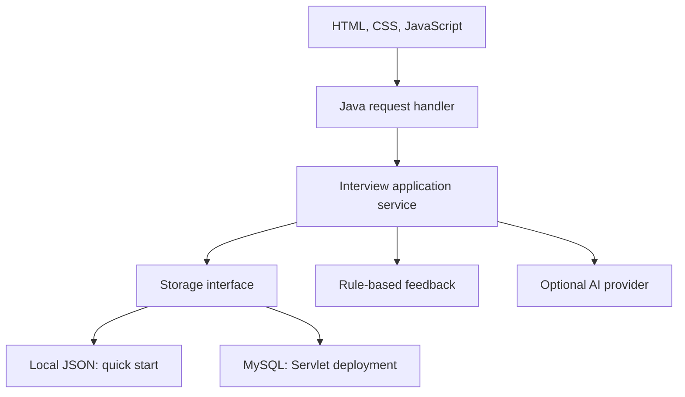

Interview Studio
A mock interview simulator for web and Java developer roles. Pick a role and a difficulty, answer five questions, get practice feedback, and come back to your saved sessions whenever you like.
Built for the Web Technologies course, Woxsen University.
Team member	Roll number
Sarvajeet Bajikar	25WU0101123
Adhiraj Kalkundrikar	25WU0101007
---
Features
Accounts: registration and login with PBKDF2 password hashing and HttpOnly session cookies.
Two roles, two levels: Web developer and Java developer, each at Beginner and Intermediate.
Question bank: 20 reviewed questions (five per role and level), shuffled for every session.
Flexible answers: type your response, or use browser voice input and edit the transcript before submitting.
Never lose work: answers are saved before evaluation, duplicate submissions are blocked, and unfinished sessions can be resumed.
Honest feedback: rule-based hints with a reference explanation. Optional AI feedback is available when you configure a provider.
Your history: review past sessions and download any session as JSON.
Safe by default: same-origin checks on every write, and each account can only see its own data.
> **A note on feedback.** Rule-based mode matches reference terms. It does not judge meaning or correctness and never shows a made-up score. AI mode gives written comments only, not a hiring prediction.
Quick start
You need JDK 17 or newer (a JRE alone is not enough). Check with `java -version`.
Windows: double-click `start.bat` and keep the terminal open.
macOS / Linux:
```sh
sh start.sh
```
Then open http://localhost:8080 and create an account.
The quick start uses a small Java HTTP server with local JSON storage in `data/`. It needs no Node, Maven, database or AI key. Accounts and history stay on disk between restarts, but stopping the server signs everyone out.
Run with Servlet and MySQL (Docker)
Install and start Docker Desktop, then in the project folder:
```sh
cp .env.example .env     # on Windows PowerShell: Copy-Item .env.example .env
# edit .env and set both database passwords
docker compose up --build
```
Open http://localhost:8080. Docker builds `ROOT.war`, runs it on Tomcat 10.1 (Jakarta Servlet 6) and starts MySQL 8.4 with a persistent volume.
Do not run `docker compose down -v` unless you want to delete the database.
Changing a password in `.env` does not change it inside an existing MySQL volume.
Quick-start and Docker modes keep separate data, and both use port 8080, so run only one at a time.
Existing Tomcat
```sh
mvn -B package
```
Deploy `target/ROOT.war` to Tomcat 10.1 and set `DB_URL`, `DB_USER` and `DB_PASSWORD` as server environment variables. Create the database and user first; the app creates its `learner_records` table on startup.
Optional AI feedback
The adapter works with any OpenAI-compatible Chat Completions API. Set these on the server and restart:
```text
AI_API_KEY=your-key
AI_ENDPOINT=https://api.openai.com/v1/chat/completions
AI_MODEL=gpt-4.1-mini
```
For Docker, put them in `.env`. For the quick start, export them in the terminal before launching (`.env` is not read automatically). Pick a model that supports `response_format: json_object`; provider charges may apply.
AI mode appears in session setup only once a key is configured, and there is no silent fallback to rules. If the provider fails, the answer stays saved and you can retry up to three times (25-second timeout per call). Never put keys in `app.js`, this README or GitHub.
Voice input depends on your browser and may send audio to its own recognition service. Only the final submitted text is stored.
How it works

`LocalServer` and `ApiServlet` are two thin adapters over the same application service, so both run modes behave the same way.
```text
src/main/webapp/            HTML, CSS, JavaScript, favicon
src/main/java/com/interview/
  App.java                  Authentication, session rules, feedback
  Questions.java            Reviewed question bank and references
  Store.java                File and JDBC storage
  Json.java                 Small dependency-free JSON codec
  LocalServer.java          Quick-start HTTP adapter
src/servlet/java/           Jakarta Servlet adapter
tests/integration.py        HTTP, persistence and ownership tests
compose.yaml, Dockerfile    Tomcat + MySQL stack
.github/workflows/          Build and test on GitHub
```
API
Method	Path	Purpose
POST	`/api/auth/register`	Create an account
POST	`/api/auth/login`	Sign in
POST	`/api/auth/logout`	End the current session
GET	`/api/me`	Current account and AI availability
GET, POST	`/api/sessions`	List or create interviews
GET	`/api/sessions/{id}`	Interview state (owner only)
POST	`/api/sessions/{id}/answers`	Submit an answer with question ID and idempotency key
POST	`/api/sessions/{id}/retry`	Retry a failed evaluation
GET	`/api/health`	Health check
POST requests need a same-origin `Origin` header. Answers are 10 to 6,000 characters. Each account holds up to 200 sessions. Logins last eight hours (in memory), with a limit of 12 sign-in attempts per minute per IP.
Testing
With Python 3 and JDK 17:
```sh
python tests/integration.py
```
The suite starts an isolated server on port 18081 with temporary storage and covers the full session lifecycle, duplicate and conflicting requests, account separation, origin protection, logout, and persistence across a restart. It does not touch your local data. The GitHub Actions workflow also builds the WAR and runs these tests on every push.
What was and was not verified is recorded in `TESTING.md`. In short, the Java HTTP path is tested; the Docker, Maven and live AI paths still need a check on your own machine before a demo.
Put it on GitHub
```sh
git init
git add .
git commit -m "Build Interview Studio mock interview simulator"
git branch -M main
git remote add origin https://github.com/YOUR_USERNAME/ai-mock-interview-simulator.git
git push -u origin main
```
Upload the contents of this folder, including `.github`, `.gitignore`, `.dockerignore` and `.env.example`. Never upload `data/`, `.env`, `build/` or `target/`.
GitHub stores the code but GitHub Pages cannot run the Java backend or MySQL. To share a live site, deploy the Docker stack on a server with one app instance, persistent storage, HTTPS and `COOKIE_SECURE=true`, and pass the public `Host` and `Origin` through your reverse proxy. The included Compose file binds to loopback on purpose.
Limitations
This is an academic prototype, not a production hiring platform.
Each learner is stored as one JSON record (local file or MySQL JSON column), not the six-table schema proposed in the project report.
Questions live in source code; there is no admin screen, numeric score, resume upload, video analysis, password recovery or email verification.
Requests are serialised inside one JVM, so a slow AI call can delay others. Run one instance.
Browser drafts sit in `sessionStorage` until submitted or signed out. Do not enter sensitive personal information in practice answers.
For real users, you would add a job queue for evaluation, a normalised schema with optimistic concurrency, pooled connections, shared sessions and rate limits, tested migrations, backups and account deletion.
References
Jakarta Servlet 6
Tomcat 10.1
MySQL Connector/J
Maven WAR plugin
