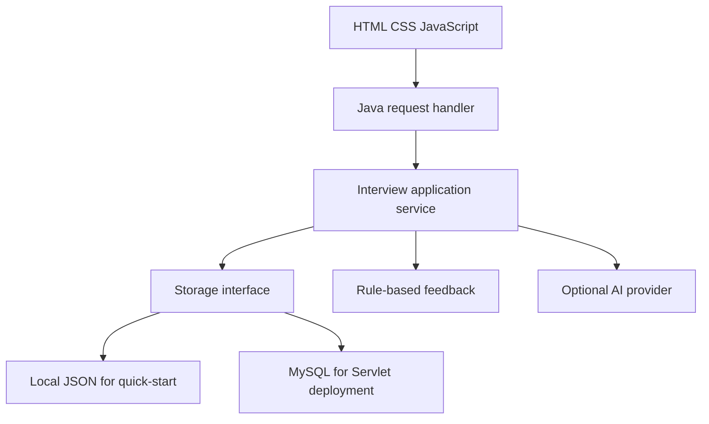

# Interview Studio

A complete student-project mock interview application. Choose a role, answer five questions, review feedback and revisit your saved sessions.

**Sarvajeet Bajikar — 25WU0101123**  
**Adhiraj Kalkundrikar — 25WU0101007**  
Web Technologies, Woxsen University

## Start on Windows (easiest)

1. Install **JDK 17 or newer**. A JRE alone is insufficient. Confirm `java -version` in a new terminal.
2. Extract this project folder.
3. Double-click **start.bat**. Keep its terminal open.
4. Open **http://localhost:8080** and create an account.

On macOS/Linux, run `sh start.sh` from this folder and open the same address.

This quick-start runs a Java HTTP adapter with durable local JSON storage in `data/`. No Node, Maven, database server or AI key is required. Stopping the server signs users out; accounts and interview history remain on disk. Restart with the same command and sign in again.

## What works

- Account registration and login, PBKDF2 password hashing, HttpOnly session cookies.
- Web developer and Java developer interviews, beginner and intermediate levels.
- 20 reviewed questions, five per role/difficulty combination, shuffled per session.
- Typed answers, optional browser speech recognition with an editable transcript.
- Saved answers, duplicate-submission protection, resume and session review.
- Clearly labelled rule-based hints with a reference explanation.
- Optional AI-assisted feedback with validated output and bounded retries.
- Session export as JSON and a responsive dark interface.
- Same-origin mutation checks and per-account resource access checks.

Rule-based mode matches reference terms. It does **not** assess meaning or technical correctness and does not assign a misleading AI score. AI mode supplies qualitative comments, not a hiring prediction or a validated numerical rubric.

## Course setup: Java Servlet + MySQL

Install Docker Desktop and start it. In this project folder:

```powershell
Copy-Item .env.example .env
# Edit .env and replace both database password placeholders.
docker compose up --build
```

Open **http://localhost:8080**. Docker builds `ROOT.war`, runs it under Tomcat 10.1 with Jakarta Servlet 6, and starts MySQL 8.4. The MySQL volume retains records after `docker compose down`.

**Do not use `docker compose down -v` unless you intend to delete the database.** Changing a password in `.env` does not change the password inside an existing MySQL volume. Update the database user explicitly when changing credentials.

The two run modes use separate storage. A quick-start account will not automatically appear in MySQL. Do not run both on port 8080 at the same time.

### Maven / existing Tomcat

```sh
mvn -B package
```

Deploy `target/ROOT.war` to Tomcat 10.1. Set these server environment variables before startup:

```text
DB_URL=jdbc:mysql://localhost:3306/interview
DB_USER=interview
DB_PASSWORD=your-database-password
```

Create the database and grant the application user access first. The app creates its `learner_records` table at startup. In a production environment use a reviewed migration and a user without schema-change privileges.

## Optional AI feedback

The included adapter accepts an OpenAI-compatible Chat Completions API. Set the following environment variables **on the server**, then restart it:

```text
AI_API_KEY=your-key
AI_ENDPOINT=https://api.openai.com/v1/chat/completions
AI_MODEL=gpt-4.1-mini
```

For Docker, add the values to the local `.env` file. For the Java quick-start, `.env` is not automatically read: set environment variables in the terminal before running the launcher. Choose a model available to your provider/account that supports `response_format: json_object`. Provider usage may incur charges.

AI mode becomes available in session setup after the key is configured. It sends the question, reference explanation and answer to the configured provider. There is no silent fallback pretending that rules are AI. If the provider fails, the answer stays saved and feedback can be retried up to three times. The provider call has a 25-second timeout. Never put keys into `app.js`, the README or GitHub.

Voice recognition depends on browser support and permission. Your browser may send audio to its recognition service. This app stores only the final submitted text, not audio. Always review the transcript before submitting.

## Upload to GitHub

### GitHub website

1. Create a new repository named `ai-mock-interview-simulator`.
2. Choose **Add file → Upload files**.
3. Upload the **contents inside this folder**, not just the ZIP. Include `.github`, `.gitignore`, `.dockerignore` and `.env.example`.
4. Commit the upload. Do not upload `data/`, `.env`, `build/` or `target/`.

### Git (recommended)

Run inside the extracted project folder, replacing the remote with your new repository URL:

```sh
git init
git add .
git commit -m "Build Interview Studio mock interview simulator"
git branch -M main
git remote add origin https://github.com/YOUR_USERNAME/ai-mock-interview-simulator.git
git push -u origin main
```

The included GitHub Actions workflow compiles the Servlet WAR and runs the Java HTTP integration tests. A successful workflow also offers `ROOT.war` as a downloadable build artifact.

**GitHub stores the code. GitHub Pages cannot run the Java backend or MySQL.** To share a working website publicly, deploy the Docker application and database to a server that supports them. Keep one app instance, persistent database storage, HTTPS and `COOKIE_SECURE=true`. Preserve the public `Host` and `Origin` through your reverse proxy. The provided Compose file binds to loopback intentionally for local testing.

## Architecture



`LocalServer` and `ApiServlet` call the same application service. Questions live in `Questions.java`. The server persists an answer before evaluation and returns a saved failed state if the evaluator is unavailable.

### Project map

```text
src/main/webapp/          HTML, CSS, JavaScript and favicon
src/main/java/com/interview/
  App.java               Authentication, session rules and feedback
  Questions.java         Reviewed question bank and references
  Store.java             File and JDBC storage implementations
  Json.java              Small dependency-free JSON codec
  LocalServer.java       JDK HTTP quick-start adapter
src/servlet/java/         Jakarta Servlet deployment adapter
tests/integration.py     Real HTTP, persistence and ownership tests
pom.xml                  Servlet WAR build
compose.yaml             Tomcat + MySQL local stack
.github/workflows/       Build and test on GitHub
```

## API summary

| Method | Path | Purpose |
|---|---|---|
| POST | `/api/auth/register` | Create an account |
| POST | `/api/auth/login` | Sign in |
| POST | `/api/auth/logout` | Invalidate current session |
| GET | `/api/me` | Current account and AI availability |
| GET / POST | `/api/sessions` | List or create interviews |
| GET | `/api/sessions/{id}` | Owner's interview state |
| POST | `/api/sessions/{id}/answers` | Submit answer with question ID and idempotency key |
| POST | `/api/sessions/{id}/retry` | Retry an unavailable evaluation by submission key |
| GET | `/api/health` | Process health |

POST requests require a same-origin `Origin` header. Answer length is 10–6,000 characters. Each account can hold up to 200 sessions. This version uses in-memory eight-hour login sessions and a per-IP limit of 12 authentication attempts per minute.

## Testing

With Python 3 and JDK 17 installed:

```sh
python tests/integration.py
```

The test starts an isolated server on port 18081 with temporary storage, checks the full session lifecycle, duplicate/conflicting requests, access separation, origin protection, logout and persistence across a server restart. It does not modify your local account data.

See `TESTING.md` for the actual verification performed during creation and checks to run for the optional deployment paths.

## Scope and report alignment

This is a working academic prototype, not a production hiring platform. The report described a proposed design. This implementation deliberately uses a small JSON aggregate per learner (in local files or a MySQL JSON column) instead of the report's proposed six-table normalized schema. The question bank lives in source code rather than an admin interface. There is no numeric rubric score, resume upload, video analysis, password recovery, email verification or question-bank admin.

The application serializes service requests inside one JVM to keep the small persistence model consistent. A slow AI evaluation can delay other requests. Run **one application instance**. For a multi-user production service, move evaluation to a job queue, normalize the schema, add database-level optimistic concurrency, use pooled connections, shared sessions/rate limits, tested migrations and a mature JSON library. Add backup, retention and account-deletion controls before collecting real users' private responses.

Browser drafts are stored in sessionStorage on the current tab until submitted or signed out. Server records remain until the local data or database records are deleted. Do not put sensitive personal information in practice answers.

## Documentation

- [Jakarta Servlet 6](https://jakarta.ee/specifications/servlet/6.0/)
- [Tomcat 10.1](https://tomcat.apache.org/tomcat-10.1-doc/)
- [MySQL Connector/J](https://dev.mysql.com/doc/connector-j/en/)
- [Maven WAR plugin](https://maven.apache.org/plugins/maven-war-plugin/)
